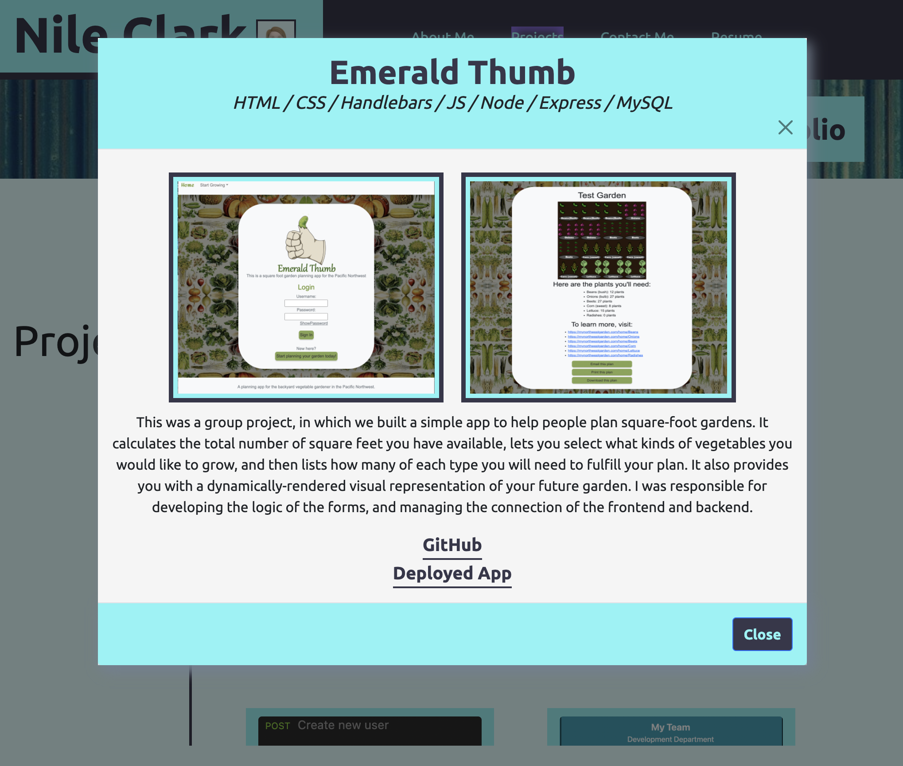
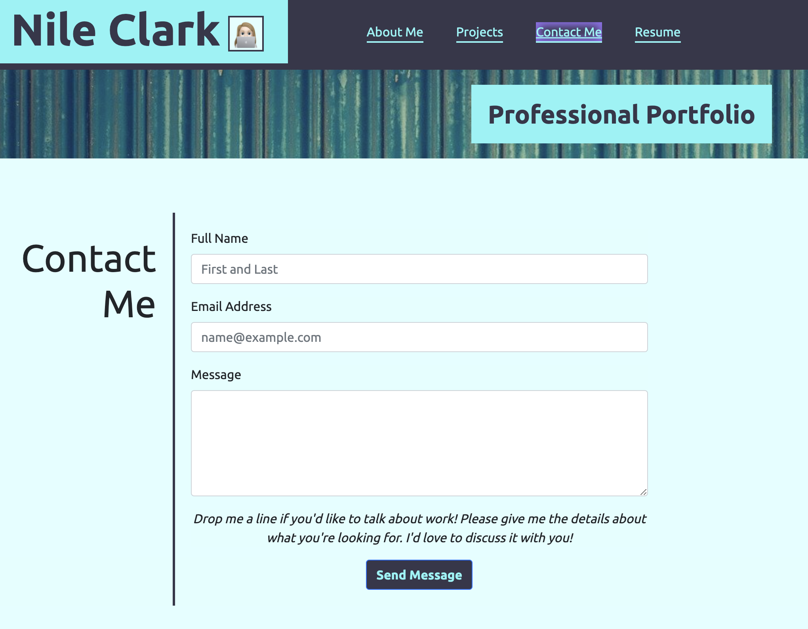
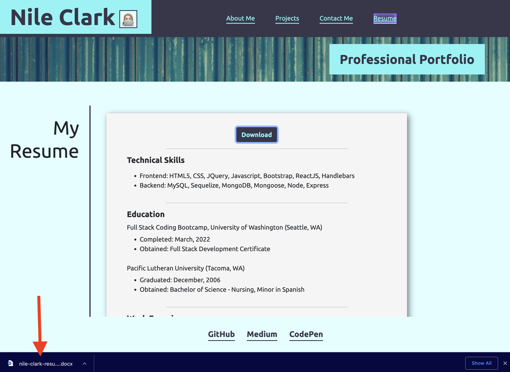

# Nile Clark, Professional Portfolio

This is my React Portfolio. It has been deployed to Heroku for the moment, and will soon be deployed to my own domain name. It contains A short about me section, exemplars of my work to date, a page sharing different ways to connect with me, and a downloadable version of my resume.
    
In the very near future, I will be deploying to my own domain name.

## Table of Contents
* [Installation](#installation)
* [Instructions for Use](#instructions-for-use)

* [License](#license)
    
## Installation
1. This program requires the following programs be installed:<ul><li>Node.js</li><li>react-bootstrap</li><li>react-router-dom</li><li>EmailJS account (there is a free option)</li></ul>

2. Before running this program, please have the following information on hand and / or loaded into your 'asset/images' folder:<ul><li>EmailJS account service ID, template name, and user ID</li><li>Screenshots of projects you'd like to feature</li><li>Text about each project you'd like to feature</li></ul>

## Instructions for Use
<ol><li>Run `npm i` to install the needed packages.</li><li>Enter your EmailJS service ID, template name, and user ID into the .env file to enable email.</li><li>If you wanted to put in your own project images and info, you will need to empty out the images file and replace it with your own screen shots, find the `images` array in the `Projects/index.js` file, import your images, and edit the information to include your project info.</li><li>When you are ready to test, run the command `npm run start`, and the app should begin in your browser.</li><li>Please reference the screenshots below for a visual of the pages, and visit the deployed Heroku link below:</li></ol>
 
Heroku: https://nile-clark-portfolio.herokuapp.com/
 
Screenshots:

## License
The files in this repository are covered by the [MIT License](https://choosealicense.com/licenses/mit/).
